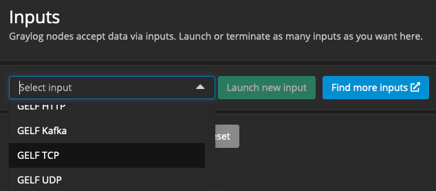
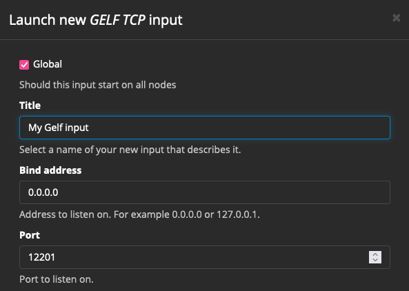

Hi!<br>
<br> 
This repo supports a hands-on demo on configuring a simple log collector and SIEM.<br>
New:<br>
- Create Ansible user chapter 8 <br>
- Added openssh-server instruction  <br>
- Added podman-docker to instructions. Thanks Hans N.! <br>
- Better use a 8GB for the VM <br>
<br>
Disclaimer: This is a walkthrough hands-on demo for experts. You must make you own judgement about safely instally and running code downloaded from the web. The supplied yml files are NOT secure enough for production systems. I am not responsible for any damage to systems belonging to you or to others.<br>
<br>

<br>
<br>
This page will help you get started fast. <br>
We'll get the following up and running before following along the hands-on demo:<br>
- Linux Ubuntu Desktop VM<br>
- install git<br>
- install and test podman<br>
- clone this rep<br>
- install and test docker-compose<br>
- clone, build, run and test fluentbit<br>
- launch Graylog, MongoDB and Elastic Search<br>

## Create a virtual Linux environment. 

For Windows: use WSL with Ubuntu. <br>
WSL users only: Make sure systemd runs. You may have to update WSL and add/write to /etc/wsl.conf the following:

```
[boot]
systemd=true
```
<br>
We'll use an Ubuntu 22.04.2 LTS Desktop image based VM with 8GB mem (or min 4GB), 2 CPU on a minimum 25GB disk.<br>

#### 1. Make sure openssh-server is installed on the VM:

```
sudo apt update
sudo apt install openssh-server
```

#### 2. Make sure curl and git are installed

```
sudo apt install curl git
```

#### 3. Clone this repo<br>

Find the http link on this page.<br> 
```
git clone <https://.....>
```

#### 4. Install a container platform<br> 
<br>
While docker-compose is open source, Docker (c) is not. <br> 
In a commercial environment you'll need to check your required license for Docker (c).<br>
To be sure we'll now use open source podman.<br>

```
sudo apt install podman
sudo apt install podman-docker
```

Make sure everything works:

```
podman run hello-world:latest
or 
sudo docker run hello-world:latest
```

#### 5. Install docker-compose<br>

We'll require Docker Compose to deploy the Graylog environment in a pretty easy way.<br>
The Ubuntu repository contains docker-compose but it's quite outdated.<br>
<br>
We'll go for a newer version.<br>
(Short cut: with the docker-compose version in Ubuntu you'll probably be fine for the demo: sudo apt install docker-compose)<br>
Note: For production systems I don't recommend to add docker pgp repositories to apt for many reasons, one being that you don't want logging systems to be compromised by wrong deployments or new releases with changed functionality. <br>
Anyway as always "it depends".<br>
For now we'll get a fixed version. <br> 
Check https://github.com/docker/compose/releases for a recent version.<br>
<br>
Remove installed old docker-compose:

```
sudo apt remove docker-compose
```
```
# X86 platform
curl -SL https://github.com/docker/compose/releases/download/v2.17.3/docker-compose-linux-x86_64 -o /usr/local/bin/docker-compose
# Apple M1 platform
curl -SL https://github.com/docker/compose/releases/download/v2.17.3/docker-compose-linux-aarch64 -o /usr/local/bin/docker-compose
```

```
chmod 700 /usr/local/bin/docker-compose
. ~/.bashrc
cd ~
docker-compose -v
```

You should see:<br>

```
Docker Compose version v2.17.3
```
Add docker.io as unqualified search registry:
```
sudo vi /etc/containers/registries.conf
```
Add the following lines:
```
# # An array of host[:port] registries to try when pulling an unqualified image, in order.
unqualified-search-registries = ["docker.io"]
```

Make sure it works:<br>
Create a folder test and create a file there called docker-compose.yml<br>
Contents:

```
version: '2'
services:
  hello_world:
    image: ubuntu
    command: [/bin/echo, 'Hello world']
```

In the same folder run:

```
sudo docker-compose up
```

The expected output:

```
...
...
Creating test_hello_world_1 ... done
Attaching to test_hello_world_1
hello_world_1  | Hello world
test_hello_world_1 exited with code 0
```

You might run in the problem that 

```
Cannot connect to the Docker daemon at unix:///var/run/docker.sock. Is the docker daemon running?
```

This will most probably fix that:

```
sudo systemctl enable podman.socket
sudo systemctl start podman.socket
mv /usr/local/bin/docker-compose /bin/docker-compose
sudo chmod uo+rx /bin/docker-compose 
export "DOCKER_HOST=unix://$XDG_RUNTIME_DIR/podman/podman.sock"
```

Run this to clean up:

```
sudo docker-compose down
```

Make sure you understand what is happening!<br>
<br>
Play with docker-compose and get a demo website running.<br>
See this nice tutorial:<br>
https://www.digitalocean.com/community/tutorials/how-to-install-and-use-docker-compose-on-ubuntu-22-04#step-1-installing-docker-compose
<br>
<br>

#### 6. Fluentbit build and install</b>

Basically we'll follow https://docs.fluentbit.io/manual/installation/sources/build-and-install <br>
in the steps below.<br>

6.1. Install all build tools and requirements.

``` 
sudo apt update
sudo apt -y install cmake
sudo apt -y install flex
sudo apt -y install bison 
sudo apt -y install libyaml-dev
sudo apt -y install libssl-dev
sudo apt -y install libsystemd-dev  
sudo apt -y install pkg-config
sudo apt -y install g++
``` 

Clone the Fluentbit repo:

```
 git clone https://github.com/fluent/fluent-bit
```

Make the necessary files:<br>


``` 
$ cd ~/fluent-bit
$ cd build
$ cmake ..
$ make
```

The "make" can take a long time depending on your CPU speed and virtualization. <br>
Skip the "make install" step. <br>
We'll might demonstrate this with Ansible, later on. <br>
<br>
Copy the fluent-bit binary you just made to the repo folder where you cloned this repository.

```
cp ~/fluent-bit/build/bin/fluent-bit ~/Workshop-Log-Collector/repo/
```

6.2. Make sure fluent-bit is runable

``` 
cd ~/Workshop-Log-Collector/repo/
./fluent-bit
```

The output should be something like this:

```
Fluent Bit v2.1.3
** Copyright (C) 2015-2022 The Fluent Bit Authors
** Fluent Bit is a CNCF sub-project under the umbrella of Fluentd
** https://fluentbit.io

...[2023/05/15 21:20:07] [ info] [fluent bit] version=2.1.3, commit=6ae59962d6, pid=16301
...[2023/05/15 21:20:07] [ info] [storage] ver=1.4.0, type=memory, sync=normal, checksum=off, max_chunks_up=128<br>
...[2023/05/15 21:20:07] [ info] [cmetrics] version=0.6.1<br>
...[2023/05/15 21:20:07] [ info] [ctraces ] version=0.3.0<br>
[2023/05/15 21:20:07] [ info] [sp] stream processor started<br>
```

Ctlr-C will stop her. <br>
#### 7. Almost ready! Let get Graylog running

<br>
Go to the Graylog folder:

```
cd ~/Workshop-Log-Collector/graylog
```

Create you own Admin password:

```
echo -n "Enter Password: " && head -1 </dev/stdin | tr -d '\n' | sha256sum | cut -d" " -f1
```

Locate the GRAYLOG_ROOT_PASSWORD_SHA2 ENV variable in the graylog-01.yml file and change the hash:

```
e.g
      - GRAYLOG_ROOT_PASSWORD_SHA2=3caa4ecb66975caabf9810540eebca0bd830e8df6fba97574cda3cf6a2505bd0
```

Launch the Graylog/Elastic environment.

```
sudo docker-compose -f graylog-01.yml up
```

If all goes well you'll find the login of Graylog with a browser at <br>

```
http://localhost:7555/gettingstarted
```
Tip: If the network of the VM is bridged with the host, the web browser may be that of the host. <br>
Note 1: This version does not retain settings you make in Graylog!<br>
Note 2: (warning destructive:) If you want to reset all images and volumes:  sudo podman system prune -a; sudo podman volume rm -a<br>
<br>

#### 8. Install ansible - optional - I hope to add to this part later.

If we have time left we'll use ansible to deploy the logcollector to the VM.<br>
Install Ansible on host and create ansible user on the VM.<br>
<br>

```
On the VM setup Ansible user with ssh access (note: we'll not create a password):
sudo -i
useradd ansible
usermod -aG sudo ansible
mkdir -p /home/ansible/.ssh
chmod 700 /home/ansible/.ssh
vi /home/ansible/.ssh/authorized_keys
<paste your pub key> 
chmod 600  /home/ansible/.ssh/authorized_keys
chown -R ansible:ansible /home/ansible
```

Check if you can login to VM without password:

```
ssh ansible@<vm IP (bridged mode)>
```

<br>
Great! You made it with the install. <br><br>


#### 9. Running the whole chain (as demonstrated in hand-on)
All config files have been added to this repo.<br>
So let's refresh our local folder. <br>

```
cd ~/Workshop-Log-Collector/
git pull  
```

The fluent bit config files are in the repo folder.<br>
As each fluent bit output to the stdio it's very neat to have a terminal with split windows to see all the output in one view. I personnally like Terminator.<br>

``` 
sudo apt install terminator

```
Situation:<br>
- we have logs in /var/logs which we want shipped to Graylog
- fluent bit A collects the logs with a tail input and sends them to (1) stdout and (2) fluent bit B
- fleunt bit B receives the records from fluent bit A and parses them (creating keys from the message) and forwards the enriched records with GELF format to the Graylog.
- Graylog receives the records through a GELF input and stores them in the Elastic Search database
<br>
Lauch the Graylog container in a separate terminal instance (if you stopped it):

```
cd ~/Workshop-Log-Collector/graylog
export "DOCKER_HOST=unix://$XDG_RUNTIME_DIR/podman/podman.sock"
sudo docker-compose -f graylog-01.yml up
```

Log into Graylog with a browser with your Graylog admin account.<br>
Configure a GELF input:<br>
<br>
<br>
<br>
<br>
<br>
<br>
<br>
We'll not configure TLS and other security features; It's a demo.<br>
<br>
Let fire up the fluent bits!<br>
Switch to Terminator and split the screen. <br>
In window 1:<br>

```
cd ~/Workshop-Log-Collector/repo
./fluent-bit -c fluent-bit_A.conf
```
You'll get warnings/errors because fluent-bit_B is not running yet.<br>
In Window 2:<br>

```
cd ~/Workshop-Log-Collector/repo
./fluent-bit -c fluent-bit_B.conf
```
<br>
You should see data in Graylog's webpage in Search screen and by pressing the run button in right corner. 
<br>
If so, Congratulation! Otherwise there some things to check... :)<br>
<br>

For further exploration: <br>
- Read the documents on our logcollectors on our company sites <br>
- Read the FluentBit website <br>
<br>
Let me know if you run into any challenges on the way.
<HR>
Abby Eeninkwinkel 2023 
