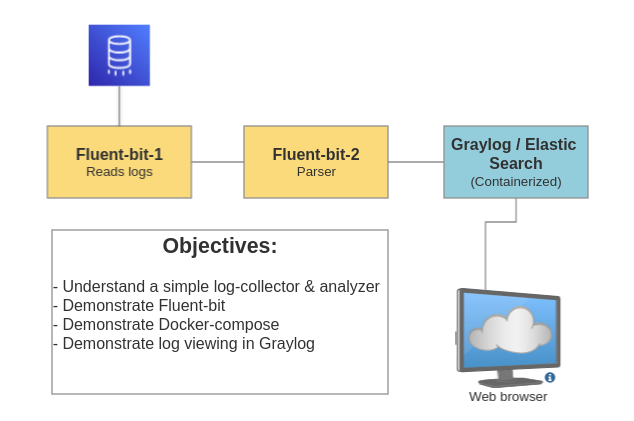

Hi!<br>
<br> 
This repo supports a hands-on demo on configuring a simple log collector and SIEM.<br>
<br>
Disclaimer: This is a walkthrough hands-on demo for experts. You must make you own judgement about safely instally and running code downloaded from the web. The supplied yml files are NOT secure enough for production systems. I am not responsible for any damage to systems belonging to you or to others.<br>
<br>

<br>
<br>
This page will help you get started fast. <br>
We'll get the following up and running before following along the hands-on demo:<br>
- 1 Linux Ubuntu VM
- installed git
- installed and tested podman
- clone this repo
- installed and tested docker-compose 
- clone, build, run and test fluentbit
- launch Graylog, MongoDB and Elastic Search

1. All demo's are in a virtual Linux environment. 

For WIndows: use WSL with Ubuntu. <br>
We'll use a Ubuntu 22.04.2 LTS VM with 4096MB mem, 2 CPU on a minimum 25GB disk.<br>

2. Make sure git is installed

```
sudo apt install git
```

3. Clone this repo<br>

Find the http link on this page.<br> 
```
git clone <https://.....>
```

4. Install a container platform<br> 
<br>

https://docs.docker.com/engine/install/ubuntu/
<br>
Note: While docker-compose is open source, Docker (c) is not. <br> 
In a commercial environment you'll need to check your required license for Docker (c).<br>
To be sure we'll now use open source podman.<br>

```
sudo apt install podman
```

Make sure everything works:

```
podman run hello-world:latest
or
sudo docker run hello-world:latest
```

5. Install docker-compose<br>

We'll require Docker Compsoe to deploy the Graylog environment in a pretty easy way.<br>
The Ubuntu repository contains docker-composer but it's quite outdated.<br>
<br>
We'll go for a newer version.<br>
Note: For poduction systems I don't recommend to add docker pgp repositories to apt for many reasons one being that you don't want logging systems to be compromised by wrong deployments or new releases with changed functionality. >br>Anyway as allways "it depends".<br>
For now we'll get a fixed version. <br> 
Check https://github.com/docker/compose/releases for a recent version.<br>

```
mkdir -p ~/.docker/cli-plugins
chmod 700 ~/.docker/cli-plugins
# X86 platform
curl -SL https://github.com/docker/compose/releases/download/v2.17.3/docker-compose-linux-x86_64 -o ~/.docker/
cli-plugins/docker-compose
# Apple M1 platform
curl -SL https://github.com/docker/compose/releases/download/v2.17.3/docker-compose-linux-aarch64 -o ~/.docker/cli-plugins/docker-compose

chmod 700 ~/.docker/cli-plugins/docker-compose
echo 'PATH=$PATH:~/.docker/cli-plugins/' >> ~/.bashrc
cd ~
docker-compose -v
```

You should see:<br>

```
Docker Compose version v2.17.3
```

Make sure it works:<br>
Create a folder test and create a file there called docker-compose.yml<br>
Contents:

```
version: '2'
services:
  hello_world:
    image: ubuntu
    command: [/bin/echo, 'Hello world']
```

In the same folder run:

```
sudo docker-compose up
```

The expected output:

```
...
...
Creating test_hello_world_1 ... done
Attaching to test_hello_world_1
hello_world_1  | Hello world
test_hello_world_1 exited with code 0
```

Run to clean up:

```
sudo docker-compose down
```

Make sure you understand what is happening!<br>
<br>
Play with docker-compose and get a demo website running.<br>
See this nice tutorial:<br>
https://www.digitalocean.com/community/tutorials/how-to-install-and-use-docker-compose-on-ubuntu-22-04#step-1-installing-docker-compose
<br>
<br>

6. Fluent build and install</b>
Basically we'll follow https://docs.fluentbit.io/manual/installation/sources/build-and-install <br>

6.1. Install all build tools and requirements.

``` 
sudo apt update
sudo apt -y install cmake
sudo apt -y install flex
sudo apt -y install bison 
sudo apt -y install libyaml-dev
sudo apt -y install libssl-dev
sudo apt -y install libsystemd-dev  
sudo apt -y install pkg-config
sudo apt -y install g++
``` 

Clone the Fluentbit repo:

```
 git clone https://github.com/fluent/fluent-bit
```

``` 
$ cd build
$ make
```

Skip the "make install" step <b>
We'll might demonstrate this with Ansible, later on. <br>
<br>
Copy the fluent-bit binary you jsut made to to the repo folder wher eyoud this repository.

```
cp ~/fluent-bit/build/bin/fluent-bit ~/Workshop-Log-Collector/repo/
```

6.2. Make sure fluent-bit is runable

``` 
cd ~/Workshop_Log_Collector/repo/
./fluent-bit
```

The output should be something like this:

```
Fluent Bit v2.1.3
** Copyright (C) 2015-2022 The Fluent Bit Authors
** Fluent Bit is a CNCF sub-project under the umbrella of Fluentd
** https://fluentbit.io

...[2023/05/15 21:20:07] [ info] [fluent bit] version=2.1.3, commit=6ae59962d6, pid=16301
...[2023/05/15 21:20:07] [ info] [storage] ver=1.4.0, type=memory, sync=normal, checksum=off, max_chunks_up=128<br>
...[2023/05/15 21:20:07] [ info] [cmetrics] version=0.6.1<br>
...[2023/05/15 21:20:07] [ info] [ctraces ] version=0.3.0<br>
[2023/05/15 21:20:07] [ info] [sp] stream processor started<br>
```

Ctlr-C wil stop her. <br>

7. Almost ready! Let get Graylog running

Creates you own Admin password:

```
echo -n "Enter Password: " && head -1 </dev/stdin | tr -d '\n' | sha256sum | cut -d" " -f1
```

Locate the GRAYLOG_ROOT_PASSWORD_SHA2 ENV variable in the graylog-01.yml file and change the hash:

```
e.g
      - GRAYLOG_ROOT_PASSWORD_SHA2=3caa4ecb66975caabf9810540eebca0bd830e8df6fba97574cda3cf6a2505bd0
```

Launch the graylog environment

```
sudo docker-compose -f graylog-01.yml
```

If all goes well you'll find the login of Graylog with a browser at <br>

```
http://localhost:7555/gettingstarted
```
Tip: If the netrwork of the VM is bridged The webbrowser may be that of the host. <br>
Note: This version does not maintain setting you make in Graylog!
<br><br>
Great! You made it with the install. <br>
For further exploration: <br>
- Read the documents on our logcollectors on our comapany sites <br>
- Read the FluentBit website <br>
- Maybe even get the thing logging :) <br>
<br>
Let me know if you run into any challenges on the way.
<HR>
Abby Eeninwkinkel 2013 
